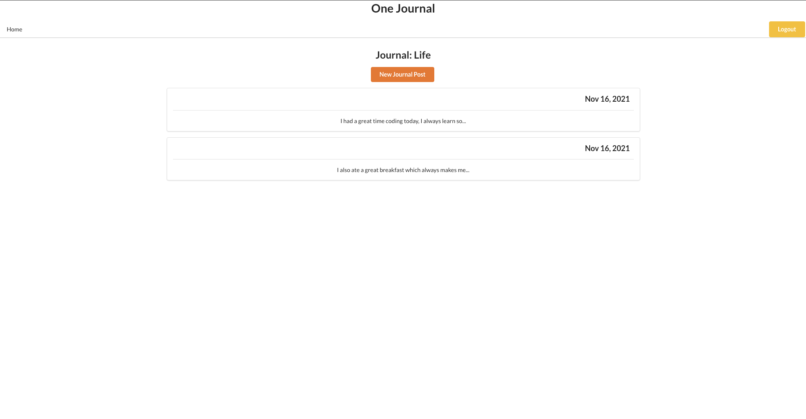

# One Journal

A simple journal app for reflecting on your day

## Description

One Journal is an app that lets you create journals for any topic you want to write about.


Create journal posts in a journal for anything you wish, and ponder over the happenings of today. 



## Install your own copy 

Fork and clone this repository.

Then cd into the project directory and run:

```sh
npm install
npm start
```

## Environment Setup

Verify you are running a recent version of Node with:

```sh
node -v
```

If your Node version is less than 14, update it with:

```sh
nvm install node
```

You can also update your npm version with:

```sh
npm i -g npm
```

## Built with

<div align="left">


</div>

### This Repository contains the frontend for One Journal. [The backend can be found here.](https://github.com/Zio-4/one-journal-api)